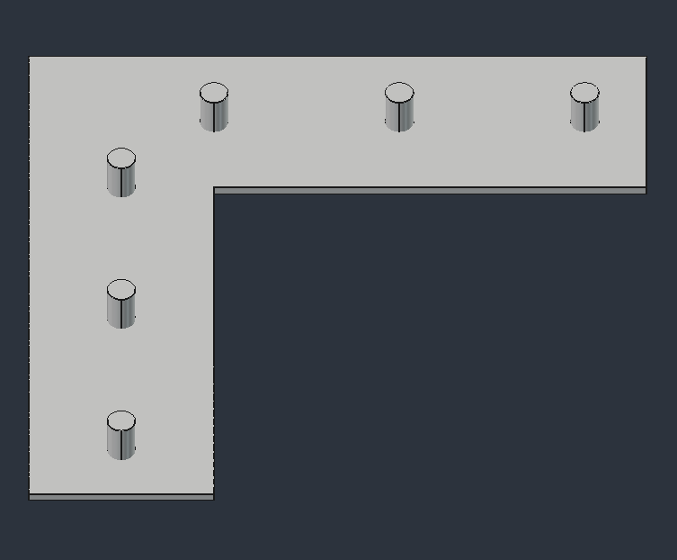
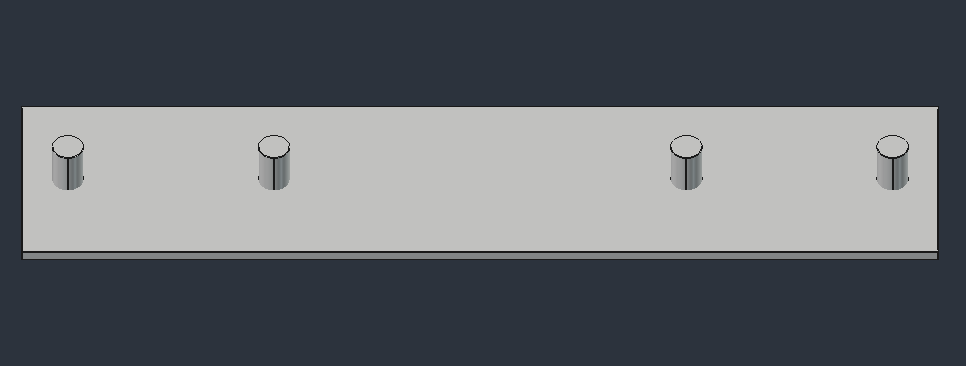

# CAD files of the INRIA Paris Robotics Lab
All files are given in freecad format (FCStd) or in mesh format (STL)
>[!TIP]  
> Github has a built in stl viewer : you can clic on the slt link for a 3D preview of the piece.

## Description of the parts:
### Franka
[ball.FCStd](franka/ball.FCStd): ball end effector, mainly used for contact and force control experiments :

    

### Mantis 
[calib_ur.FCStd](mantis/calib_ur.FCStd)

    

[calib_ur2.FCStd](mantis/calib_ur2.FCStd)

    

[support_orbec_hub.FCStd](mantis/support_orbbec_sync_hub.FCStd)

    

### Unitree
#### Go2
[go2_replacement_rail_velcro.FCStd](unitree/go2/go2_replacement_rail_velcro.FCStd) : replacement of the aluminium rail bars used on the Unitree Nvidia Jetson backback with velcro slits (STL: [go2_replacement_rail_velcro.stl](unitree/go2/go2_replacement_rail_velcro.stl))

    

[go2_tether.FCStd](unitree/go2/go2_tether.FCStd) : Link between the builtin leash and a carabiner (STL : [go2_tether.stl](unitree/go2/go2_tether.stl))

    

[go2_realsense_mount.FCStd](unitree/go2/go2_realsense_mount.FCStd) : Head mount for a realsense D431 camera (STL: [go2_realsense_mount.stl](unitree/go2/go2_realsense_mount.stl))

    

### Vention
[vention_cable_holder.FCStd](vention/vention_cable_holder.FCStd) : clip for holding a roll of cable to a vention profile (stl :[vention_cable_holder.stl](vention/vention_cable_holder.stl))

    

