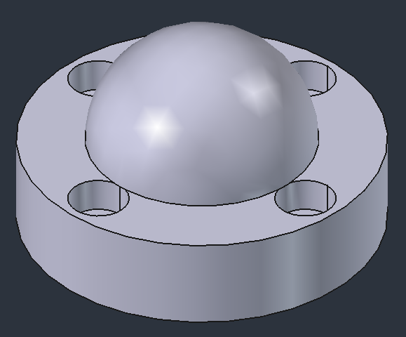
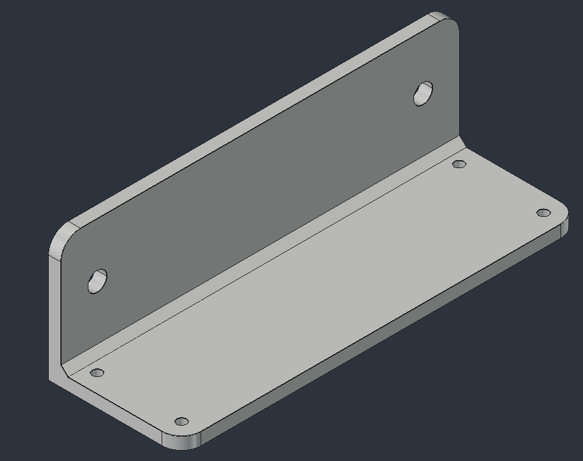
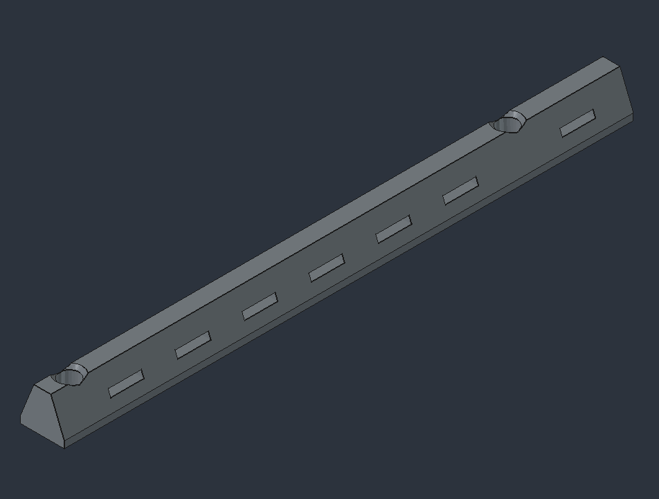
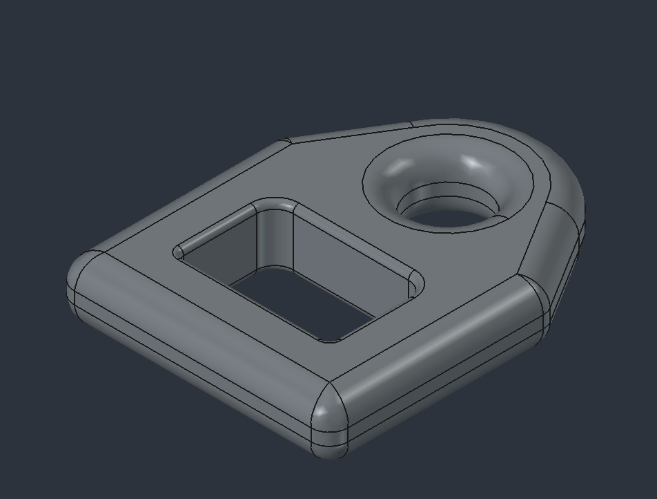
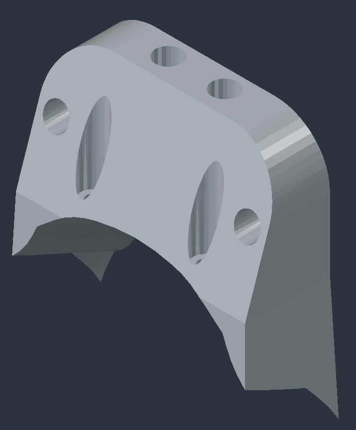
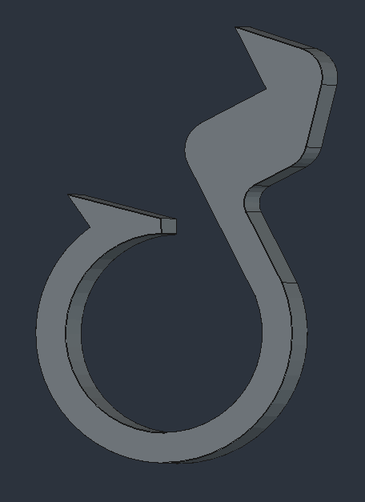

# CAD files of the INRIA Paris Robotics Lab
All files are given in [freecad](https://www.freecad.org/) format (FCStd) or in mesh format (STL)
>[!TIP]  
> Github has a built in stl viewer : click on "[PREVIEW]" for a 3D preview of the piece.

## Description of the parts:
### Franka
[ball.FCStd](franka/ball.FCStd): ball end effector, mainly used for contact and force control experiments  
 [[PREVIEW]](franka/ball.stl)

    

### Mantis 
[support_orbec_hub.FCStd](mantis/support_orbbec_sync_hub.FCStd) : support to screw the Orbec hub to a vention profile

    

### Unitree
#### Go2
[go2_replacement_rail_velcro.FCStd](unitree/go2/go2_replacement_rail_velcro.FCStd) : replacement of the aluminium rail bars used on the Unitree Nvidia Jetson backback with velcro slits  
[[PREVIEW]](unitree/go2/go2_replacement_rail_velcro.stl)

    

[go2_tether.FCStd](unitree/go2/go2_tether.FCStd) : Link between the builtin leash and a carabiner  
[[PREVIEW]](unitree/go2/go2_tether.stl)

    

[go2_realsense_mount.FCStd](unitree/go2/go2_realsense_mount.FCStd) : Head mount for a realsense D431 camera  
[[PREVIEW]](unitree/go2/go2_realsense_mount.stl)

    

### Vention
[vention_cable_holder.FCStd](vention/vention_cable_holder.FCStd) : clip for holding a roll of cable to a vention profile  
[[PREVIEW]](vention/vention_cable_holder.stl)

    

